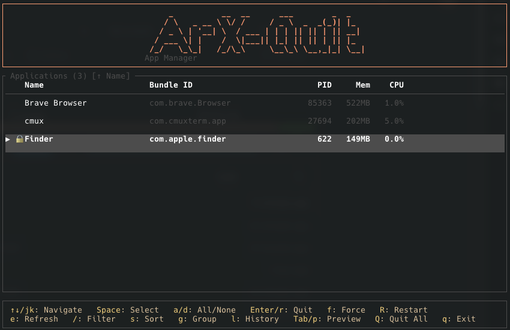

```
     _          __  __      ___        _  _
    / \   _ __ \ \/ /     / _ \  _  _(_)| |_
   / _ \ | '__| \  / ___ | | | || || | || __|
  / ___ \| |    /  \|___|| |_| || || | || |_
 /_/   \_\_|   /_/\_\     \__\_\ \__,_|_| \__|
```

[](https://github.com/atransf/ArX-Quit/actions/workflows/ci.yml)



A terminal UI application for macOS that lists all running GUI applications and lets you quit them — gracefully or by force.

Built with Rust and [Ratatui](https://ratatui.rs/).

## Features

- Lists all running GUI applications with bundle IDs, PIDs, memory, and CPU usage
- **Real-time CPU monitoring** — CPU% updates every second via delta-based sampling
- **Graceful quit** — sends a quit command via AppleScript (like Command+Q)
- **Force quit** — sends SIGKILL to the process (like Force Quit dialog)
- **Restart** — graceful quit followed by automatic relaunch
- **Quit all** — quit every non-protected app at once
- **Multi-select** — select multiple apps and quit them all at once
- **Filter** — search apps by name in real time
- **Sort** — cycle through sort modes (Name, PID, Memory)
- **Protected apps** — system-critical apps (Finder, Dock, etc.) cannot be quit
- **Mouse support** — click to select, double-click to toggle, scroll to navigate
- Confirmation dialog before any quit action
- Quit history log
- Auto-refreshes the app list every 5 seconds

## Installation

### Prerequisites

- macOS
- [Rust](https://rustup.rs/) (1.85+)

### Setup script

```bash
git clone https://github.com/atransf/ArX-Quit.git
cd ArX-Quit
bash setup.sh
```

The setup script provides three options:

1. **Install** — builds from source and installs `arxkill` to `/usr/local/bin`
2. **Update** — rebuilds and replaces the existing binary
3. **Uninstall** — removes the binary

### Run directly (without installing)

```bash
cargo run
```

### Run after install

```bash
arxkill
```

## Keybindings

| Key | Action |
|---|---|
| `↑` / `k` | Move cursor up |
| `↓` / `j` | Move cursor down |
| `Space` | Toggle select/deselect app |
| `a` | Select all apps |
| `d` | Deselect all apps |
| `Enter` / `r` | Graceful quit (selected or cursor) |
| `f` | Force quit (selected or cursor) |
| `R` | Restart app |
| `Q` | Quit all non-protected apps |
| `/` | Filter apps by name |
| `s` | Cycle sort mode |
| `g` | Toggle grouping |
| `l` | Toggle quit history |
| `p` / `Tab` | Toggle preview panel |
| `e` | Refresh app list |
| `q` / `Esc` | Exit ArX-Quit |

### Confirmation dialog

| Key | Action |
|---|---|
| `y` / `Enter` | Confirm quit |
| `n` / `Esc` | Cancel |

### Filter mode

| Key | Action |
|---|---|
| Type | Filter by name |
| `Backspace` | Delete character |
| `/` / `Esc` | Exit filter |

## Configuration

### Protected apps

By default, system-critical apps (Finder, Dock, WindowServer, loginwindow, SystemUIServer) are protected from being quit.

Add custom protected apps in `~/.config/arx-quit/protected.toml`:

```toml
protected = ["Safari", "Terminal"]
```

## How it works

1. **Listing apps** — Uses AppleScript via `osascript` to query System Events for all foreground (non-background) processes, retrieving names, bundle identifiers, and PIDs
2. **Real-time CPU** — Samples cumulative CPU time via `ps cputime` every second and computes delta-based CPU% between snapshots
3. **Graceful quit** — Sends `tell application "AppName" to quit` via AppleScript (non-blocking), allowing the app to save state and close cleanly
4. **Force quit** — Sends `kill -9 <PID>` to immediately terminate the process
5. **Restart** — Graceful quit followed by `open -b <bundle_id>` after a short delay

## Project structure

```
src/
  main.rs      — Entry point, terminal setup/teardown, event loop
  app.rs       — Application state, message handling, key bindings
  ui.rs        — TUI layout and rendering (header, list, footer, dialogs)
  process.rs   — macOS process listing, CPU sampling, quit, restart
```

## Dependencies

- [ratatui](https://crates.io/crates/ratatui) — Terminal UI framework
- [crossterm](https://crates.io/crates/crossterm) — Cross-platform terminal manipulation
- [anyhow](https://crates.io/crates/anyhow) — Error handling
- [toml](https://crates.io/crates/toml) — Configuration parsing
- [serde](https://crates.io/crates/serde) — Deserialization

## License

MIT
